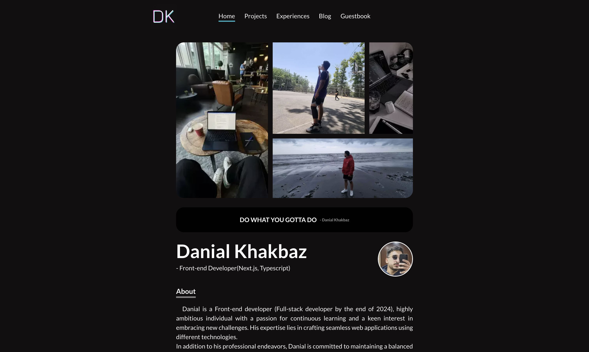
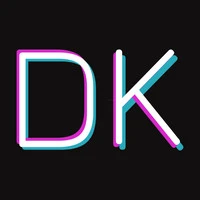

# Danial Khakbaz's Portfolio



Danial Khakbaz's portfolio built with [Next.js](https://nextjs.org/), showcasing his skills as a Front-end developer with a journey toward becoming a Full-stack developer. This project highlights his ambition for continuous learning and crafting seamless web applications using modern technologies.

## Project Overview

This portfolio website serves as a professional platform to showcase Danial’s work, skills, and personal philosophy on balanced living. It is optimized for performance and utilizes several popular tools and libraries for a smooth, interactive user experience.

## Table of Contents

- [Features](#features)
- [Technologies Used](#technologies-used)
- [Installation](#installation)
- [Development Scripts](#development-scripts)
- [Folder Structure](#folder-structure)

## Features

- **Responsive Design**: Fully responsive layout with smooth animations.
- **Interactive Animations**: Powered by Framer Motion.
- **MDX Support**: Easily integrates Markdown with React components.
- **Theme Customization**: Leveraging Chakra UI for theme flexibility.
- **View Transitions**: Provides smooth transitions between pages.
- **Form Integration**: Contact form connected to EmailJS for direct communication.

## Technologies Used

- **[Next.js](https://nextjs.org/)** - React framework for server-side rendering and static website generation.
- **[React](https://reactjs.org/)** - JavaScript library for building user interfaces.
- **[Chakra UI](https://chakra-ui.com/)** - Component library for building accessible React applications.
- **[Framer Motion](https://www.framer.com/motion/)** - Animation library for React.
- **[EmailJS](https://www.emailjs.com/)** - Service to send emails directly from the client-side.
- **[TypeScript](https://www.typescriptlang.org/)** - JavaScript with static typing.

## Installation

To set up this project locally, follow these steps:

1. **Clone the repository**:
   ```bash
   git clone https://github.com/your-username/danielo-portfolio.git
   cd danielo-portfolio

2. **Install dependencies**:
   ```tsx
   yarn

3. **Run the development server**:
   ```tsx
   yarn dev

4. **Open http://localhost:3000 in your browser to see the project**.

## Development Scripts

Here are some helpful scripts to assist in the development and maintenance of this project:

```dev```: Runs the app in development mode. <br/><br/>
```build```: Compiles the app for production. <br/><br/>
```start```: Starts the production server. <br/><br/>
```lint```: Lints and fixes files using ESLint. <br/><br/>
```fix```: Formats files using Prettier. <br/><br/>
```check-prettier```: Checks the code format without making changes. <br/>

---

Feel free to reach out with any questions or feedback on the project. Enjoy exploring!

<h1 align="center">
  
</h1>